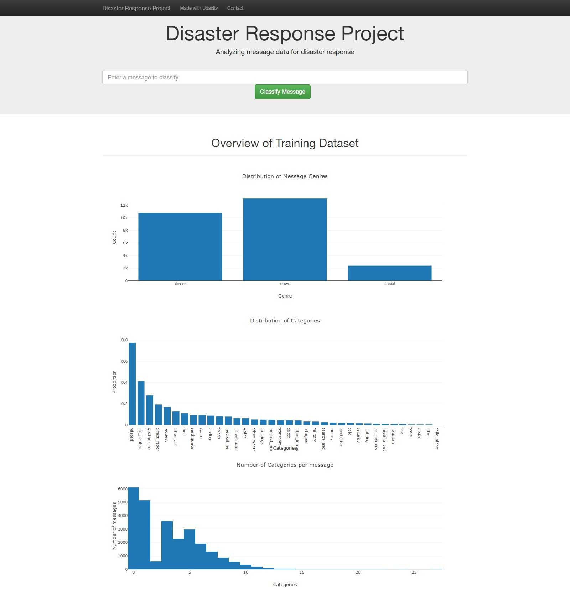

# Disaster Response Pipeline Project

This is a Udacity project from the Data Scientist Nanodegree.
The goal is to categorize messages that have been sent during disasters 
so that the message can be transferred to the appropriate organisation 
that takes care of this issue. The project also includes a Flask-powered 
webapp where an emergency worker can input messages and see the matching 
categories in return.

### Instructions:
1. Run the following commands in the project's root directory to set up your database and model.

    - To run ETL pipeline that cleans data and stores in database
        `python data/process_data.py data/disaster_messages.csv data/disaster_categories.csv data/DisasterResponse.db`
    - To run ML pipeline that trains classifier and saves
        `python models/train_classifier.py data/DisasterResponse.db models/classifier.pkl`

2. Run the following command in the app's directory to run your web app.
    `python run.py`

3. Go to http://0.0.0.0:3001/

### Acknowledgements
I wish to thank Figure Eight for the dataset and Udacity for advice on this project.